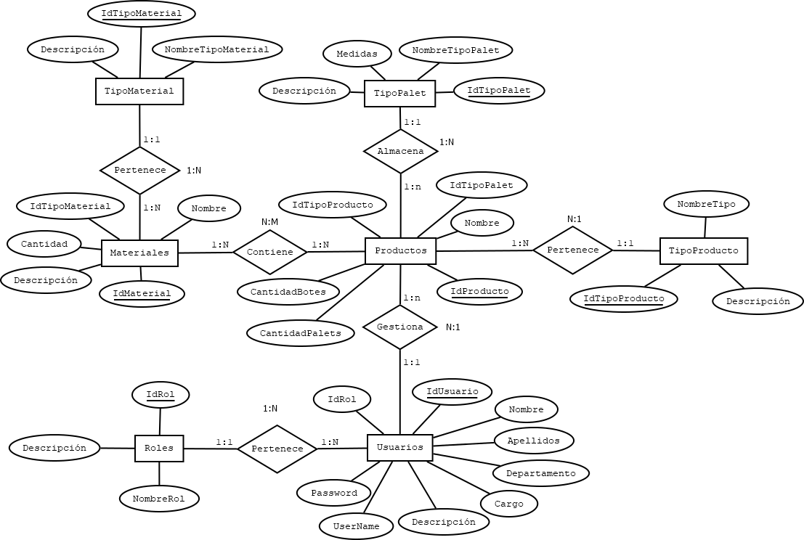
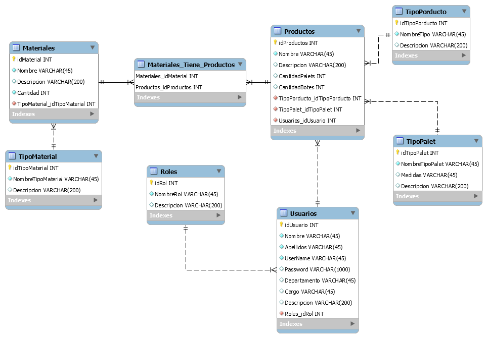

# Base de Datos

#### Tablas
	
* Productos: IdProducto, Nombre, Tipo, Descripción, TipoPalet, CantidadPalets y CantidadBotes.
* TipoProducto: IdTipoProducto, NombreTipo y Descripción.
* TipoPalet: IdTipoPalet, NombreTipoPalet, Medidas y Descripción.
* Usuarios: IdUsuario, Nombre, Apellidos, UserName, Password, Rol, Departameto, Cargo y Descripción.
* Roles: IdRol, NombreRol y Descripción.
* Matriales: IdMaterial, Nombre, TipoMaterial, Cantidad y Descripción.
* TipoMatrial: IdTipoMaterial, NombreTipoMaterial y Descripción.

#### Modelo ER

#### Modelo Relacional

